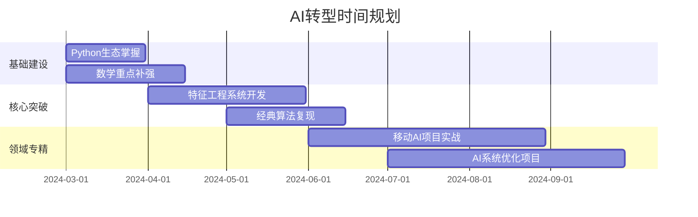

# ai-engineer

---

### **AI转型方案：基于你的技术背景的快速通道**  
结合你10年全栈开发经验和信息系统基础，制定以下**AI工程师转型路径**，充分利用现有技术栈，最小化重复学习成本，聚焦高ROI（投资回报率）知识点：

---

#### **一、技能迁移策略**
| 现有技能          | AI领域应用场景                          | 迁移示例                                  |
|-------------------|----------------------------------------|------------------------------------------|
| **Golang/C#**     | 高性能模型服务部署、分布式训练框架开发   | 用Golang开发模型推理API网关               |
| **Swift/Obj-C**   | 移动端AI应用开发（Core ML模型集成）      | 将PyTorch模型转换为Core ML格式部署到iOS   |
| **Node.js**       | AI服务中间件开发、数据处理流水线构建     | 用Node.js开发特征工程微服务               |
| **Java/Kotlin**   | 安卓端AI应用开发（TensorFlow Lite集成）  | 在Android Studio中集成MediaPipe模型       |

---

#### **二、学习路线图（6-9个月）**
##### **阶段1：AI基础建设（1-2个月）**
- **数学补强**  
  - 重点突破：矩阵运算（特征值分解）、概率分布（贝叶斯定理）、梯度计算  
  - 实践工具：用Python NumPy复现《深度学习》(花书)数学推导案例  
  - 参考资源：[《Matrix Calculus for Deep Learning》](https://arxiv.org/abs/1802.01528)  

- **Python生态速成**  
  - 关键库：NumPy（矩阵运算）→ Pandas（数据处理）→ Matplotlib（可视化）  
  - 效率技巧：用你的Golang经验优化Python性能（Cython/C++扩展）  
  - 项目示例：用Pandas分析Kaggle的[Titanic数据集](https://www.kaggle.com/c/titanic)

##### **阶段2：机器学习核心（2-3个月）**
- **特征工程系统**  
  - 开发模式：用C#/Golang构建分布式特征处理服务（替代Python的Spark）  
  - 工具链：Protocol Buffers定义特征Schema，gRPC实现服务通信  

- **算法实践重点**  
  | 算法类型       | 必须掌握的算法                  | 你的优势利用点                  |
  |----------------|--------------------------------|---------------------------------|
  | **监督学习**   | XGBoost、LightGBM              | 用C++源码理解树模型优化细节      |
  | **深度学习**   | CNN（ResNet）、Transformer      | 用CUDA C++自定义算子             |
  | **强化学习**   | Q-Learning、PPO                | 用多线程优化环境模拟效率         |

- **推荐学习路径**：  
  1. 精读《Hands-On Machine Learning》第2版（跳过基础Python语法部分）  
  2. 在Kaggle用[Tabular Playground](https://www.kaggle.com/competitions)系列赛验证特征工程能力  
  3. 复现经典论文算法（如ResNet）并用Swift开发移动端演示App  

##### **阶段3：领域专精（3-4个月）**
- **方向选择建议**  
  ```mermaid
  graph TD
    A[你的技术背景] --> B{AI方向建议}
    B --> C[移动端AI架构师]
    B --> D[AI系统工程师]
    C --> E[Core ML/TFLite优化]
    C --> F[端侧模型蒸馏]
    D --> G[分布式训练框架]
    D --> H[模型服务高并发]
  ```

- **移动端AI专精路线**  
  - 核心技术栈：  
    - ONNX模型转换 → Core ML/TFLite量化 → Metal Performance Shaders优化  
    - 参考项目：复现[Apple的MobileNet优化方案](https://developer.apple.com/documentation/coreml)  
  - 开发工具链：  
    - 用你的Swift经验开发[Core ML Tools](https://coremltools.readme.io/)插件  
    - 在Android Studio集成[TFLite Model Maker](https://www.tensorflow.org/lite/models/modify/model_maker)  

- **AI系统工程师路线**  
  - 核心技术栈：  
    - 用Golang开发[Kubeflow](https://www.kubeflow.org/)组件  
    - 用C++优化[TensorRT](https://developer.nvidia.com/tensorrt)推理引擎  
  - 开发工具链：  
    - 基于你的C#经验改进[ML.NET](https://dotnet.microsoft.com/apps/machinelearning-ai/ml-dotnet)生态  
    - 用Node.js构建[TFX](https://www.tensorflow.org/tfx)特征可视化组件  

---

#### **三、项目实战组合**
##### **必做项目清单**
| 项目类型         | 目标                                    | 技术栈选择                          |  
|------------------|----------------------------------------|-------------------------------------|
| **端侧AI应用**   | 开发iOS/Android双平台图像分类App        | Swift+Core ML / Kotlin+TFLite       |
| **AI系统优化**   | 将PyTorch模型推理速度提升3倍            | C++ CUDA扩展 + Triton推理服务器     |
| **工业级流水线** | 构建完整MLOps系统（训练→部署→监控）      | Golang + Kubeflow + Prometheus      |

##### **差异化竞争项目**
- **用Golang重写关键AI组件**  
  - 案例：用Golang实现[类似XGBoost的GBDT框架](https://github.com/dmitryikh/leaves)  
  - 优势：发挥你Golang的高并发经验，优化特征并行处理  

- **开发跨平台AI框架插件**  
  - 案例：为ONNX Runtime开发[Swift语言绑定](https://github.com/microsoft/onnxruntime/tree/main/swift)  
  - 优势：结合你的移动端经验填补生态空白  

---

#### **四、求职策略**
##### **目标岗位匹配**
| 岗位名称              | 你的竞争力锚点                          | 目标企业类型              |  
|-----------------------|----------------------------------------|--------------------------|
| **移动AI工程师**      | Swift+Core ML实战项目                   | 智能硬件公司（大疆、Tesla）|
| **AI系统架构师**      | Golang高并发服务开发经验                | 云计算厂商（AWS、Azure）  |
| **机器学习工程师**    | 特征工程+模型优化全流程能力             | 金融科技公司（Ant Group） |

##### **简历优化重点**
- **技术栈重组**：  
  ```markdown
  ## 核心技能
  - AI系统开发: ONNX Runtime优化 | Kubeflow定制 | TFLite量化  
  - 工程化能力: 高并发服务(Golang) | 移动端AI(Swift/Core ML)  
  - 算法基础: 特征交叉方案设计 | 模型蒸馏实践
  ```
- **项目描述范式**：  
  > **移动端超分辨率系统**  
  > - 用Metal Shaders优化ESRGAN模型，iPhone13推理速度从2.1s→0.4s  
  > - 开发Swift封装库，降低Core ML使用复杂度（GitHub 500+ Star）  

---

#### **五、持续学习机制**
- **论文追踪策略**：  
  - 重点关注ICML/SysML会议的系统方向论文（如分布式训练优化）  
  - 用你的开发经验复现[MLSys Award论文](https://mlsys.org/)的核心思想  

- **社区参与计划**：  
  - 向[TensorFlow Addons](https://github.com/tensorflow/addons)贡献Golang组件  
  - 在[ONNX社区](https://github.com/onnx)开发Swift绑定工具  

- **技术雷达维护**：  
  - 每季度评估新兴技术（如Mamba替代Transformer的潜力）  
  - 用你的全栈经验预判技术融合点（如WebAssembly+AI）  

---

#### **六、时间投入预估**


---

**执行建议**：  
1. **立即启动**：从[Kaggle Titanic](https://www.kaggle.com/c/titanic)开始，用Golang重写特征处理流程  
2. **构建作品矩阵**：在GitHub创建「AI-移动端」「AI-系统」双仓库，每周提交代码  
3. **技术品牌塑造**：在掘金/Medium开设专栏《十年全栈工程师的AI转型日志》  

你的工程化能力是区别于纯算法研究者的最大优势，聚焦**AI系统开发**和**移动端AI优化**方向，6个月内即可完成华丽转身。
